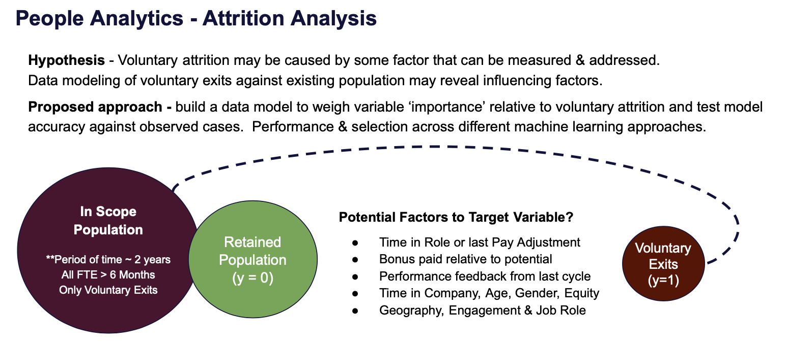

# HR_attrition_model
Step by step data science to predict voluntary attrition

**About this project:**
As a HR professional with 15 years of experience, I have worked on a range of projects across geographies and business functions.  In a sense, it all comes back to one practical question.  Are we able to sense the underlying causes of the outcomes we are observing, and if so, can we do something about them before they become a problem? 

